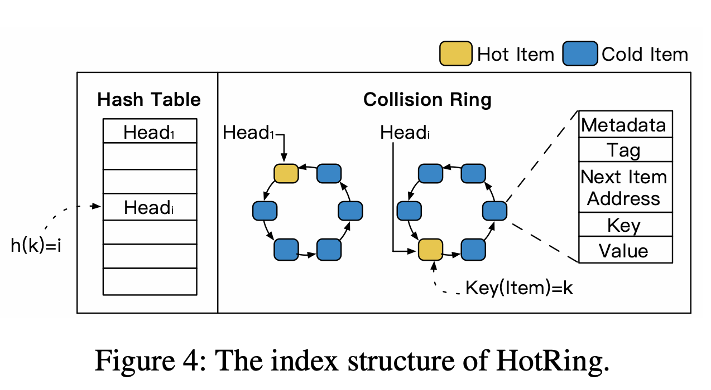
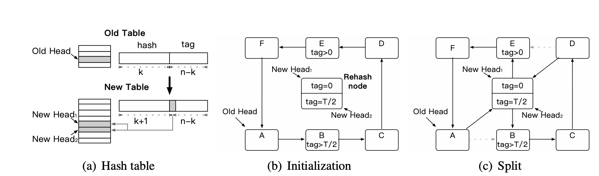
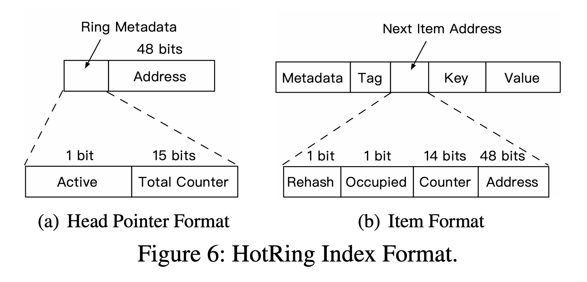

这篇论文比较好读，网上的翻译也很多，就记些有趣的地方。  
论文&视频：https://www.usenix.org/conference/fast20/presentation/chen-jiqiang

## 对hashValue的处理
  
HotRing最基本的结构如图所示，即发生hash collision时，用一个首位相接的sorted结构代替传统的chain。  
hash（key）= hashValue。为了提高比较效率，对于一个n-bit的hashValue。取hashValue的前k-bit作为hashTable的index，后(n-k)bit为tag的值。  
比较时，优先比较tag，如果tag相同，再比较key。  
然后在rehash时，size(new hashTable)=2*size(old hashTable)。index的bit数+1，也就是k->k+1。其实也就是tag部分的最高位挪到index部分的最后去。遍历时从2^(n-k-1)处断开就好。  

## 热点探测
论文中给出了两种探测方法
### Random Movement Strategy
每R次请求作为一个周期，判断每个周期内最后一次请求想access的位置是否为head pointer所指。若不是，直接把head pointer移向那个位置。
### Statistical Sampling Strategy
也是R次请求一个周期，判断周期内最后一次请求想access的位置是否为head pointer所指。如果是，不用管。如果不用管，开启sample，指针的active标志位变成1。  
sample也是R个请求一个周期。把信息直接统计在指针上。  
  
sample完后，找sum(到其他点的距离)最小的点，头指针移向那个点。（该点不一定是访问最频繁的点）。

## write-intensive HotSpot with RCU
* 小于8B的节点直接CAS更新
* 大于8B的节点用RCU（read-modify-update）更新。
  * 即new一个新的节点，然后替换旧节点。
  * 替换旧节点时，要修改前面节点的next item address，需要转一圈找前节点。所以hotRing增加counter时，直接加在上一个节点上。即头节点就会指向最佳节点的前一个节点。
  * RCU会带来并发问题，利用item的occupied标志位来标志正在被"占用"的item。具体的看论文。