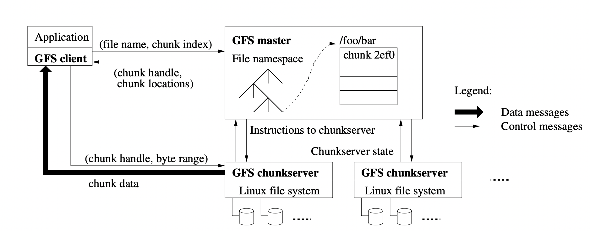

## Introduction
GFS纠正了旧分布式系统的一些错误观点：
1. component故障是常态，而非exception。所以系统需要具备监测、错误发现、fault tolerance和自动恢复的能力。
2. 现在要处理的文件很大，几GB也是常态，一个文件能包含多个内容。所以需要重新审视一些参数和假设，例如IO操作和块大小。
3. 修改文件时，"追加写"比"覆盖写"多得多。实际上，随机读写已经不存在了。所以"追加写"成为重要焦点，而缓存数据块的意义变小。
4. 共同设计application和文件系统API，减轻application的负担，增加文件系统灵活性。

## Design Overview
### Assumptions
1. component要有自己监测、发现、容忍和恢复错误的能力。
2. 文件系统中有一定数目的大文件。几GB级别的文件也是常见情况，它们需要被高效处理。小文件的处理需要被支持，但不需要做特别的优化。
3. 读workload主要有两部分组成:
   1. large streaming reads：一次读有几百KB，常大于1MB。同个client的successive操作常读文件中的相邻部分。
   2. small random reads：读某一随机位置的几KB。在意performance的application经常将small reads分批和排序，读的内容是advance steadily的，不会回到前面去读。
4. 写workload主要是大量、连续的追加写。通常写操作和读操作数量差不多。写后文件很少修改。系统支持随机写，但不保证其性能。
5. 系统能支持多个client并发。
6. 持续的高宽带比低延迟重要。大多数应用重视高速批处理数据，但很少严格控制单个读写的响应时间。
### Interface
create, delete, open, read, write, snapshot, record append（支持多个client并发追加写）
### Architecture
  
一个master，多个chunkServer，多个client。  
#### chunkServer
1. 文件被分割成固定大小的chunk。每个chunk有个64-bit的chunk handle（master分配）。chunk存储在local disks上，chunkServer对chunk的读写操作由（chunk handle, byte range）确定。  
2. 默认情况下，同个chunk会在3个chunkServer上有replica。用户可以对不同的file namespace设计不同的replication level。
3. 不会缓存文件信息。因为chunks are stored as local files，linux的buffer cache就够用了。

#### master
1. 保存了所有的metadata，包括namespace、access control information、file->chunk的映射、locations of chunks等。
2. 执行系统层面操作，例如chunk lease management、garbage collection of orphaned chunks、chunkServer间的chunk migration等。
3. master periodically 通过HeartBeat Message同chunkServer交流，给出指令并且收集chunkServer的信息。

#### client
1. 不一定是linux系统。
2. metadata相关的操作同master进行，data相关的操作直接与chunkServer进行。
3. 同样不缓存file data，因为大多数applications操作的file太大或者working sets太大，也避免缓存一致性问题。
4. 会缓存metadata信息。

### Single Master
只有一个master会简化设计。然而要尽量减少master的读写操作，避免io瓶颈。所以client先从master那问到它要和哪个chunkServer交互，并缓存信息for a limited time。然后client接下来的操作都直接和chunkServer进行。  
#### Client读文件流程
1. 根据fixed chunk size，client把文件名和offset转为其在文件中的chunk index。
2. client给master发个包含了文件名和chunk index的request。
3. master返回对应的chunk handle和locations of replicas。
4. client缓存master返回的信息，key是文件名和chunk index。
5. client向其中一个replica发送请求（通常是最近的一个），请求包含chunk handle和byte range。 
* 接下来的操作都没有client-master之间的交互，直到client缓存的信息过期或文件被重新打开。
* client通常是在一次请求中拉取多个chunk相关的信息，master返回的信息也可以包含被请求的chunk后面几个chunk的信息。

### Chunk Size
设置成64MB，比通常的文件系统block size大。每个chunk文件都是个plain linux file。采用lazy space allocation，避免internal fragmentation造成的空间浪费。  
设置large chunk size的优点如下：
1. 减少client和master之间的交互。而且applications通常是sequentially读写大文件。而对于small random reads，client可以轻松缓存所有的chunk location信息。  
   > 个人理解：chunk size大了，chunk的数目也就少了。而且application的读写通常是连续，所以影响不大。而对于少数的random读写，减少chunk数目也有利于缓存所有的chunk信息。
2. 增加单个client-chunkServer的tcp链接的打开时间，也减少tcp链接数。
3. 减小master上metadata的size。

缺点如下：
小文件对应的chunk数少，可能一个文件只有一个chunk。那个chunk容易成为hot spot。
* 实践证明，hot spot不是主要问题，因为系统的主要操作是大文件的连续读写。
* 但对部分被频繁访问的文件（比如batch-queue system），hot spot会是个问题。解决方案：
  * 提高这类文件的replication factor。
  * 错开相关应用的启动时间。
  * 一个可能的长期解决方案是：在这种情况下，允许client从别的clients那读信息。

### Metadata
metadata存储在master的内存里。metadata主要有三类：file和chunk的namespace，file->chunks的映射，locations of each chunk replicas。
* 前两类会通过operation log的形式，持久化到磁盘，并在remote机器上存副本。
* chunk的位置信息不会持久化。master启动时、chunkServer加入集群时，master会向chunkServer要它的chunk信息。

#### In-Memory Data Structures
内存中存储metadata的好处：
1. 很多master操作耗时短。
2. 方便master periodically扫描内存中的metadata信息。（扫描是为了实现chunk garbage collection、chunkServer failure时的re-replication、chunk migration（平衡不同chunkServer的load和disk usage））。

实践内存的大小通常不会成为限制因素。
1. 大多数chunk是写满的。而一个64MB的chunk对应的metadata的size< 64 bit。
2. 文件的namespace的metadata大小一般也< 64 bit，因为可以通过prefix compression来压缩地存储file names。
3. 而如果真的要支持更大的文件系统，也可以直接给master加内存，价格不高，可扩展性好。

#### Chunk Locations
master不会持久化chunk的位置信息。
* 在启动时/chunkServer加入集群时从chunkServer那获取chunk的位置信息。
* 通过HeartBeat更新。 

摒除持久化的原因：
1. 比较简单，也减少master和chunkServer间的同步问题。在一个大集群中，chunkServer的加入、fail、重启、改变信息等都是很常见的。
2. chunk信息最终还是以chunkServer那存储的为准。这种设计可以减少很多同步问题。

#### Operation Log
存储了：
* 关键metadata的历史版本
* logical timeline that defines the order of concurrent operations

metadata在多台机器上有备份。只有在每台存有metadata的机器都完成持久化后，metadata的改变才能被clients看到。刷盘操作会批量进行。  
master recover通过replay operation log进行。为了减小start time，用了checkpoint机制（即将某个时间点前日志对应的状态机/内存数据结构以某种方式持久化）。  
* GFS用的是B+树，它可以直接被映射到内存中，查找namespace也很快。
* 构建checkPoint也需要花费时间。为了不阻塞别的变化，master会切换到新的log file，checkPoint记录的是新文件前的所有的操作。
* checkPoint构建完成后，本地和存有备份的远程机器都要刷盘。
* recovery只需要最新的checkPoint，但以防万一，gfs仍保留了几个旧的checkPoint和log file。如果构建checkPoint的过程中失败了，recovery时会自动跳过这个checkPoint。

### Consistency Model
GFS提供的非常relaxed的一致性模型。造成一致性问题的根本原因是多副本。
#### Guarantees by GFS
1. file namespace的改变是原子性的。用锁保证。
2. master的operation log确认了所有操作的逻辑顺序。  

一致性模型：
  
consistent定义：all clients will always see the same data, regardless of which replicas they read from.
defined定义：A region is defined after a file data mutation if it is consistent and clients will see what the mutation writes in its entirety. defined以consistent为前提。（如果是并发写造成的undefined，可能被别的client覆盖掉了）

write操作分为两种：普通的写和record append：
1. write：在指定的offset处写data。
2. record record被追加at least once，offset由GFS决定。追加完后，GFS将offset返回给application。此外，针对inconsistent的区域，GFS可能会插入填充或重复的数据，这些数据量级不大。

通过表格可知，GFS保证写的一致性，实现方法：
1. chunk发生mutation时，replica的改变顺序是确定的。
2. 针对server宕机的情况，master用chunk version去判断server持有的数据是否是陈旧、落后于别的replica的。 
   * master不会给client返回这些落后的replica的位置。
   * 落后的replica会尽早被gc掉。
   * clients会缓存chunk location，所以也无法完全避免clients读到落后的replica，但这个窗口是limited的：
     * cache有过期时间；重新打开文件也会让cache失效。
     * 大多数文件是append-only，落后的replica返回的是premature end of chunk。当reader重试并且和master交互时，它会马上拿到当前的chunk locations。

此外，component failure可以污染或破坏data。GFS通过regular handshakes和checksumming发现data问题。当问题出现后，data会根据valid replicas恢复。  
只有当所有replicas在master反应过来前都丢失的情况下（通常要在几分钟内全部丢失），一个chunk才是lost。但即使在这种情况下，applications拿到的也是clear errors，而非被污染的数据。  

#### Implications for Applications
在这个relaxed一致性模型的基础上，GFS applications可以自己通过一些方法去保证一致性：
1. 尽量append写，不要overwrite。
2. checkpoint机制，reader只会读last checkpoint前的数据。checkpoint的方法例如：
   * periodically检查写了多少数据。
   * application-level的checksum。
3. self-validating，self-identifying record。record采用append-at-least-once语法，保证了writer端的写入，但需要reader处理padding和duplicate数据：
   * record中包含checksum数据，这样可以保证record的validity。reader可以辨别并且丢弃padding和fragment record。
   * 对于无法tolerate的duplicate，record中可以增加unique identifier。

## System Interactions
### Leases and Mutation Order
为了减少master在mutation中的参与，采用了lease（租约）手段。
1. master grant a lease to primary replica.(通常只有60s)
2. the primary picks a serial order when applying mutations.(so the global mutation order is defined)
3. 如果租约到了，lease还没执行完，primary可以要求续约。
   * 通常master都会让续。
   * 续约request和grant通过heartBeat消息交换，有piggyback。
   * 偶尔master会提前收回lease，比如要执行快照。
   * 如果master和primary失联了，master可以在旧的lease到期后，给另个replica租约。（必须等过期后再给新的租约，避免primary脑裂）

  
1. client asks master which chunkServer holds the current lease for the chunk and the locations of other replicas。如果没有持有lease的chunkServer，master grants a lease。
2. master每次指定新的chunk后，会把chunk version+1，落盘（落盘是为了故障恢复）。
   * 没有直接用chunk的最大版本号最为最新版本号，因为拥有最新版本号的chunk可能处在故障中。
   * master会定期询问chunk持有的版本号，如果没有找到和master一致的版本号，master会进入等待、不响应客户端请求。
   * master也可能在lease时崩溃，重启后chunk上报一个比本地更大的版本号，master会知道租约时发生了错误，选择该版本号作为最新版本号。
   >    但是"通知client主从server信息"和"落盘"两个操作的先后性不清楚。
3. master返回主从server信息，client cache信息。
4. client pushes the data to all the replicas in any order. 
   * chunkServer会用LRU缓存data，不用马上落盘。提高效率，也等待primary安排写入顺序。
   * 此外，data flow和control flow解耦，所以可以通过网络拓补结构来调度expensive data flow，甚至能并行推送，不用像控制流一样先推primary再推副replica。（？）
5. 所有replica都向client返回ack后，client会向primary发送写（落盘）请求。primary会安排一个写顺序和写操作的序列号。
6. primary向secondary replicas发出写请求和对应的序列号。
7. secondary replicas执行完后回复primary。
8. primary回复client。任何副本写入的问题都会报告给client。如果是部分replica写入失败的情况，client会进行重试，3-7的步骤可能重复进行多次；如果还是不行，fall back to the beginning of the write.

如果某个写操作很大或者跨越多个chunk，GFS client会把它分解成多个写操作，写请求的数据可能会被间隔开，造成前面说的consistent but undefined状态。  

### Data Flow
控制流的推送有固定顺序，但数据流没有，以充分利用网络带宽。手段有：
1. 根据网络拓补推送数据流，每个机器会向它"最近"的机器推送。这个"最近"可以根据IP地址估算。
2. pipeline，减小延迟。chunkServer一收到数据，马上向别的机器推送。

### Atomic Record Appends
client只指定数据，GFS写入成功后，返回offset。record append是defined的，data在所有replica上都写入成功，并且offset都相同。具体实现上，只需在上述的写入流程中做一点改变：
1. 保证数据被写在同个chunk内：
   * 数据被推送到各个节点后。primary会检查现在的chunk是否能写下所有的数据，如果不能，就会pad当前的chunk。
   * primary pad完后，会提醒备份replica也去填充。
   * 为避免浪费，会对record的大小做限制，其大小 <= chunkSize/4。
2. 保证data在所有replica上的offset相同：
   * primary append完后，会让备份replica在相同的offset上append。
   * 如果有任何一个replica失败了，会让client重试。
   * GFS有对齐操作，如果某个replica被要求append的offset前有一段没被使用的空间（比如上次append失败了），GFS会把这块padding掉。
   * 如上所述，GFS不保证每个replica都是完全相同的，会有duplicate和padding的情况。它只保证record在某个offset被append了一次。

### Snapshot
snapshot作用：创建某个大数据集的copy，checkpoint。  
用了copy-on-write。流程如下：  
1. 收回文件中所有chunk的lease，或让所有lease都expired。
2. 记录snapshot操作到operation log。
3. 待log落盘后，再操作内存。具体是复制一份文件的metadata，两份metadata指向的chunk相同。
4. 当client想写chunk C时，master会发现指向该chunk的引用 > 1。
5. 于是master不进行lease，而是通知持有该chunk replica的server进行复制，产生新的chunk C'。
6. master将原先metadata的引用指向新的chunk C'，并向C'的一个replica进行lease。

## Master Operation
### Namespace Management and Locking
为了允许多个操作同时在master进行，用了namespace机制。  
* GFS logically represents its namespace as a lookup table mapping full pathnames to metadata.
* 用了prefix compression，上述的table占用的内存很小。
* namespace tree的每个node都有对应的read-write lock：
  * 具体的上锁保证并发例子可以看原文。
  * read-write lock objects are allocated lazily and deleted once they are not in use.
  * 为避免deadlock，上锁顺序是固定的。首先是根据tree的level来上锁（论文没说是自上而下还是自下而上），而同一个level的node，采用字典序上锁。

### Replica Placement
尽可能把replicas散布在各个rack，而不仅仅是不同machine上。   
优点：提高数据可靠性；充分利用网络带宽（尤其是在read时）。  
缺点：write时，data要推送到不同rack。  

### Creation, Re-replication, Rebalancing
小标题也就是create chunk的三个理由，分别讨论。  

#### Creation
master create chunk时，选择chunkServer的因素：
1. server的disk space使用率低于平均值。
2. 尽可能减少一个chunk上"最近被写入"的creation数。
   * GFS的常见场景是write once，然后紧跟着many read。
3. 将replica尽可能散在不同rack中。

#### Re-replication
可用副本数小于目标值时进行。  
出现副本数不足的可能原因有很多：
* chunkServer unavailable。
* server报告replica may be corrupted。
* disk挂了。
* replication goal增加。  
re-replication时，不同chunk有不同的优先级：
1. 缺replica数越大，优先级越高。first re-replicate优先级嘴高。
2. 提高阻塞client process的chunk的优先级。以减少application端的failure。  

选定优先级最高的chunk后，选择replica位置的因素同creation小节里所述。 
而为了避免clone操作占用太多带宽：
1. master会做些限制，来控制cluster和每个chunkServer正在进行的clone操作数。
2. 每个chunkServer会通过限流对source chunkServer的read requests，来限制用于clone的bandwidth。

#### Rebalance
master会periodically检查replica的分布，平衡replica分布。  
也是通过这个方法，master逐渐fill up新的chunkServer。

### Garbage Collection
#### Mechanism
1. 文件删除是给文件改个名（名字中包含deletion的timestamp），使其不可见。master regular scan时才会真正删掉已经"被删除"一段时间的文件（默认是3天）。  
2. 清除孤儿chunk（无法被别的file reach到的chunk）：
   * master scan时发现孤儿chunk。删掉其metadata。
   * 在heartBeat中，chunkServer报告其持有的chunk。master筛出server持有而它没有存metadata的chunk，返回给server。server可以随意删除这些chunk的replica。

#### Discussion
GC是很容易实现的：
* master存了所有file-to-chunk mapping，也就是保存了引用关系。
* chunkServer把replica存在指定文件夹里，所以很容易identify所有的chunk replica。 

GC相比于eager deletion的优点：
1. simple and reliable。  
   * 存在的场景：
      * chunk creation可能部分成功，导致有master不知道的replica存在。
      * replica deletion messages可能丢失。master或server出现问题都会导致这种情况。如果不用gc，master得去resend。
   * 所以，gc提供了一种通用有效的方式，去清除没用的replica。
2. gc把store reclamation融入master的regular scan中。
   * 开销小。
   * 可以批量执行操作，减小开销。
   * 可以选择只在master有空时干这事，提高master对client的回复速度。
      > 个人理解：一个是client要求删除时，打个标记就可以直接返回；还有个是真正的删除操作可以在有空时做，不影响master处理client的请求。
3. the delay in reclaiming storage也相当于一种兜底和保证，避免意外的不可恢复的删除。

缺点：主要是"还未被真正删除的伪删除文件"会占用额外的空间。优化：  
1. 对某个文件删除两个，可以使它立刻被删掉。
2. user可以对不同的namespace设计不同的删除策略。例如临时文件可以没有replication，并且删除后马上真正删掉。

#### Stale Replica Detection

参考：  
https://zhuanlan.zhihu.com/p/79746847  
https://zhuanlan.zhihu.com/p/504249307