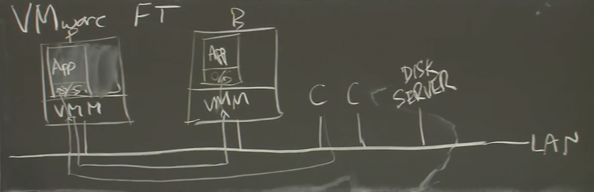
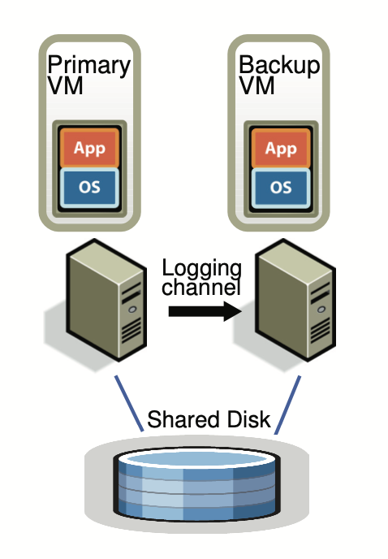

fault-tolerance的重要方式就是replication。它能解决fail-stop问题。  
> fail-stop：机器的物理故障，不包括软件bug和硬件设计的缺陷。通过纠错码等技术，可以将部分硬件故障转为fail-stop故障。
> 论文的解释：fail-stop failures can be detected before the failing server causes an incorrect externally visible action.

复制的方法主要有两种，state transfer和replicated state machine。
* state transfer：primary所有状态变化都传送到backup上。开销巨大。
* replicated state machine：
  * 将server视为初始状态相同的deterministic state machine。
  * servers以相同的顺序接收request，使它们保持同步。
  * 但是servers也有很多not deterministic的events（比如virtual interrupts）和operations（比如获取时钟、随机数等），需要extra coordination去保证它们的同步。

基本的模型：  

VMM: Virtual Machine Monitor，也就是论文中的Hypervisor。  
VMM其上能模拟出多个虚拟的计算机，安装需要的操作系统。  

  

* 虚拟机都是uni-processor，真实的os可能是多核的。
  * 多核并行处理指令的行为和顺序不确定，可能产生不同的结果。如果采用多核虚拟机，也许只能使用state transfer方案。
* primary和backup共享虚拟内存。
* 通过log channel交换必要的信息。机器级别的复制，包括所有内存和寄存器。primary和backup在底层也是完全一样的。
  * 其他应用，比如GFS，采用的是应用程序级别的复制，更加高效。但VMware FT的方案能忽略上层应用的区别，对任何软件都适用。
* Robert教授推测log中有的内容：
  1. instruction number at which the event occurred. 那么backup就可以知道这条指令是机器启动后的第几条指令，以和primary保持完全同步。
  2. type. 有些操作是特殊的，例如网络输入。
  3. data.  

> 例如：primary的时钟中断也会传递到backup上，backup机器的cpu会复制一个相同的中断，传递给VMM。
> backup有个buffer记录primary传递来的指令。如果buffer里有东西，就执行；如果没有，就不执行。所以backup一直slower than primary.

工作流程：
1. client向primary发送请求，在primary所处的物理机上产生中断，送入VMM。
2. VMM在虚拟机上模拟中断，数据传送给primary的guest操作系统。
3. VMM将请求通过logging channel发送给backup的VMM。
4. backup的VMM同样模拟中断，处理请求，以保持和primary的同步。
5. primary和backup都产生回复报文。primary的报文通过VMM模拟的虚拟网卡回复，backup的被VMM丢弃。
* 需要特别注意的是output，有个delay and ack的机制。

Q1：failover的情况下，FT协议层面不保证output只输出一次，那么os/TCP层面呢？能否通过预写output到OS缓冲区保证？会丢失吗？   
Q2：deferred-execution是啥，一定会执行吗？是不是TCP接收和发送data时都能用它？